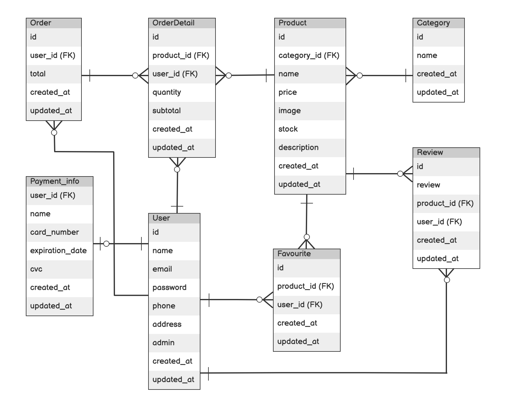
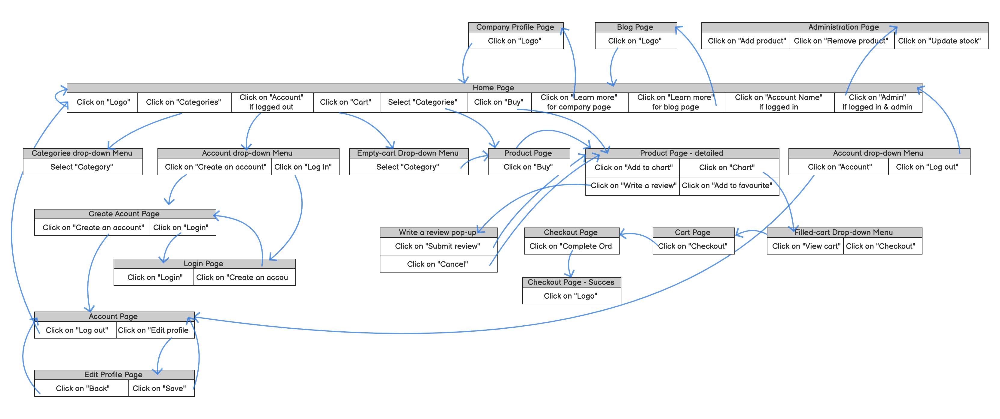

# VeganStory

A web application designed to sell 100% vegan products.

## Development Language
* Ruby 3.0.1
* Rails 7.0.2.2

## Implemented Employment Technologies
* Comment function
* Favourite function

## Implemented Technology outside The Curriculum
* Vue.js

## Execution Procedure
```
git clone https://github.com/seftyyunitasari/VeganStory
cd VeganStory
bundle install
rails db:create
rails db:migrate
rails s
```

## List of Materials
### Checksheet, Catalog Design, and Table Definition
[Checksheet, Catalog Design, and Table Definition Share Link](https://docs.google.com/spreadsheets/d/1EcLTsBIvnO_DQnak9PzefOC8QIufCSG4Dq8ep2_zGKs/edit?usp=sharing)
### Wireframes
[Wireframes Share Link](https://balsamiq.cloud/s3gmnni/psml4zk)
### ER Diagram


### Screen Transition Diagram

